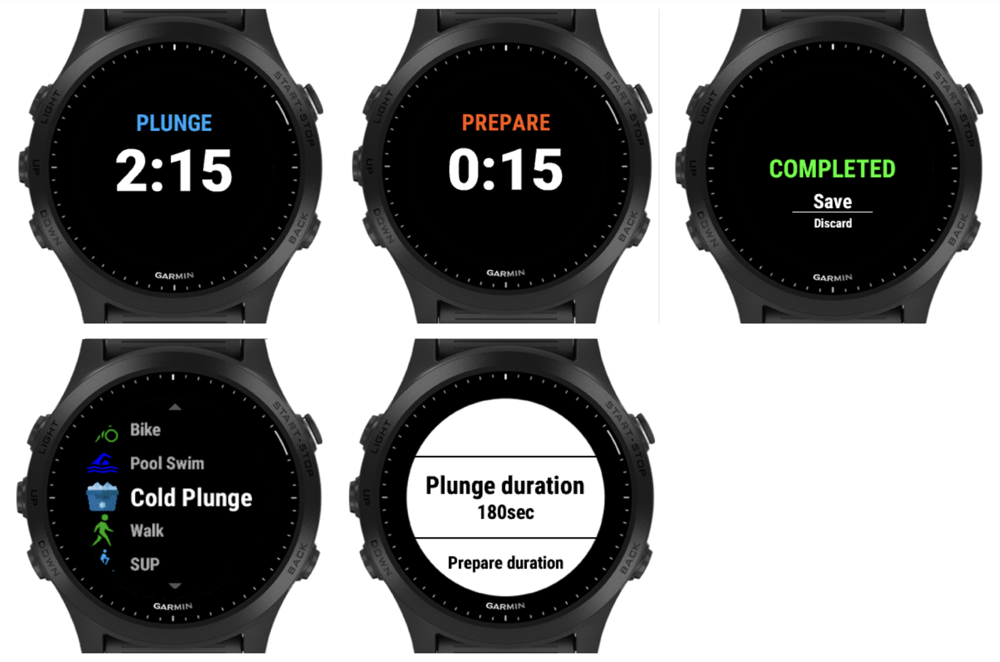

# Garmin Cold Plunge watch application

An application for Garmin watches to take a cold plunge bath  
https://apps.garmin.com/en-US/apps/9b443887-938f-42cc-a3f6-da25efa89167

# Version History

1.1.1 - Fix static heart rate value  
1.1.0 - Add heart rate  
**1.0.0 - Initial public version**  
0.4.1 - Update unique app id  
0.4.0 - Add separate Completed screen to be compatible with Instinct devices  
0.3.0 - Allow to skip Prapare step by setting duration to 0  
0.2.0 - Set an increment of Plunge duration to 5 sec  
0.1.0 - Initial mvp version

# Future enhancements

- Display temperature
- Stopwatch mode
- Disable GPS that is used by LiveTrack
- Add possibility to select default sport type, e.g Stopwatch instead of Other
- Add Pulse Ox
